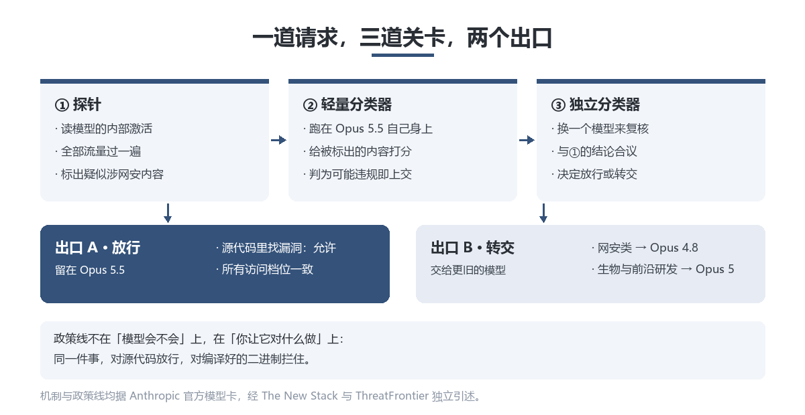
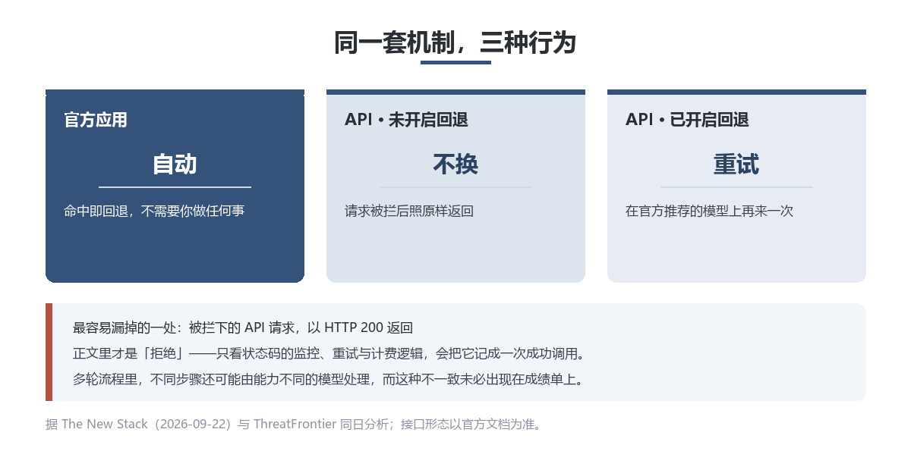

先说一件反常识的事。

从 9 月 22 日起，你发往 Claude Opus 5.5 的请求，有一部分不会由 Opus 5.5 回答——它会被转交给 Opus 4.8。

这件事 Anthropic 没有藏着。它写在模型卡里，归在「安全」名下。官方原话大意是：在大多数界面上，被网络安全分类器拦下的请求，会回退到 Opus 4.8。

于是有个问题值得停一下：如果连执行者是哪个模型都不确定，那你为 Opus 5.5 付的这笔钱，买的到底是什么？

## 一条脚注

9 月 22 日，Anthropic 发布 Claude Opus 5.5，Claude 5.5 系列的第一个模型。它的定位不是「再强一点」，而是把更贵那一档的能力压到 Opus 5 的价格带以下。

价格表很直白：输入从每百万 token 5 美元降到 4 美元，输出从 25 美元降到 20 美元，各降五分之一。真正砍得重的是缓存读取——从 0.50 美元削到 0.20 美元，降幅 60%。缓存读取恰好是 agent 与编程负载里占比最高的那部分开销，这一刀切在最厚的地方。

配合另外两项改动——单任务消耗的 token 更少、输出生成快 30% 以上——官方给出的整体口径是：典型工作负载成本比 Opus 5 低约 40%。

基准上它并非全胜。Terminal-Bench 4.0 拿到 66.4%，上一代 Opus 5 是 52.3%；但在自动化与科研类基准上，它落后同期另一家的旗舰模型。Anthropic 自己还加了句提醒：到这个水平，榜单上几分之差未必对应到真实使用中的可感差异。

但这些都不是重点。重点是藏在发布材料里的一项架构变化。

## 三层关卡

Opus 5.5 沿用了更早那套面向网络安全、生物、前沿模型研发三类领域的分类器，但把关的机制换成了三段。

第一段先读模型的内部激活，把全部流量过一遍，标出疑似涉网安的内容；第二段由跑在 Opus 5.5 自己身上的一个轻量分类器给这些内容打分；任何被判定可能违规的，交给第三段——一个独立的分类器模型，和第一段的结论合起来裁定。

裁定的结果不是「放行或拒绝」两种。对网安类请求，Opus 5.5 的答案是**转交**：大部分被标红的网安请求交给 Opus 4.8，生物与前沿研发类交给 Opus 5。

政策线画得很具体，位置在源代码和二进制之间：无论哪个访问档位，Opus 5.5 都愿意帮你在**源代码**里找漏洞——那是在写更安全的软件；但**编译好的二进制**里的漏洞发现被阻止，因为那更常被当作攻击手法。

然后是本篇最值得记的一处差别。

**在 Anthropic 自家的应用里，这个回退是自动的；在 API 上，它是需要你主动开启的。**

没开的时候，被拦的请求就是被拦——而且它以 **HTTP 200** 的状态返回，正文里写着拒绝原因，另附一个字段指明撞上了哪条政策。开了（服务端参数）之后，请求才会在官方推荐的那个模型上重试。

也就是说，同一套安全机制，在两种渠道里长出两种行为。

## 争议在哪

先摆支持这一侧的逻辑，它站得住：**能力没有被削弱，被调整的是访问。**训练没有删掉网安知识，模型照样能帮你审查代码；只是当请求滑向更敏感的领域，系统把它交给一个更保守的执行者。这比直接拒绝要好——拒绝意味着任务失败，回退至少把活干完了。官方还披露，第三方红队约 95 小时、29,000 多次请求的测试里没有找到通用越狱。

另一侧有四个问题，我认为都成立。

**第一，「透明地重路由」是个自相矛盾的词。**如果真透明，开发者不必去翻文档才知道自己在跟谁说话。Anthropic 把这件事写进了模型卡，这不算隐瞒；但写在模型卡里，和写在产品的默认行为里，是两回事。

**第二，回退到的模型更弱——弱在多一个维度上。**Anthropic 在更早那代模型的模型卡里自己记过一笔：回退会削弱对提示注入的抵抗，因为那个旧模型不如新模型鲁棒。他们随后称已加强。但请把这件事读一遍再放回去：**为了安全而做的分流，把请求交给了一个在另一个安全维度上更弱的执行者。**这不是指控，是一个需要被设计者看见的取舍。

**第三，评测的前提被改掉了。**当「每个请求都发给同一个模型」不再是默认，那些按这个假设搭起来的评测，测出来的东西就变了味。The New Stack 把这一条点得很准：在多轮 agent 流程里，不同步骤可能由能力不同的模型处理，而这种不一致，未必会出现在成绩单上。

**第四，也是最实际的一条——它不一定会告诉你的程序。**HTTP 200 在绝大多数语言和框架里意味着「成功」。如果你的监控、重试、计费逻辑只看状态码，一次被拒绝的请求会被记成一次成功的调用。

## 你该改什么

给开发者的三件事，今天就能查。

1. **去文档确认自己的场景是否落在三类分类器范围内。**做生物、安全、模型研发方向的团队，这是必查项。
2. **把拒绝原因字段加进监控与重试逻辑。**别只看 HTTP 状态码——一次「拒绝」被记成「成功」，你不会收到任何告警。
3. **假设模型身份在多步流程里会变。**prompt 调优、token 预算、行为一致性，凡是以「执行者恒定」为前提的假设，都值得重新过一遍。

然后决定要不要开启服务端回退。这不是一个纯技术选择，而是一个**你希望系统替你做什么决定**的选择。

如果你不是开发者，这条新闻有一个可转述的版本：**你买的不只是某个模型的能力，还包括一组你无法完全预知的执行条件。**名字是确定的，执行者是策略定的。

## 写在最后

我的判断（下面是判断，不是事实）：

**「模型」正在从一个产品，变成一条策略。**

过去买模型是买能力，现在买的是「能力＋一组决定它何时被替换的规则」。这件事本身未必坏——把最危险的那部分能力分档开放，是行业迟早要走的路，而且这次的分档是写在文件里、也给了申请通道的（生物方向有验证计划，网安方向的分档权限也在扩）。但有一个默认值需要被指出来：**当「不透明」是默认，「透明」就没人会去查。**

对开发者，现实含义一句话：**把「模型身份」从常量改成变量来设计。**你的流水线里，应该有一个位置专门回答「这一次是谁在跑」。

补一句平衡：别把这件事读成「厂商在骗人」。他们写在模型卡里了，也给了开关和申请通道。真正值得追问的是另一个问题——**当安全机制开始改变产品的行为，它该以什么方式通知使用者？**这件事目前没有行业标准答案。

## 聊聊

一个具体问题：你的重试逻辑里，有没有处理过「拒绝」这种返回？

如果你的监控只看 HTTP 状态码，它现在会把一次拒绝记成一次成功。留言说说你打算怎么改。

## 数据来源

- The New Stack 报道（2026-09-22），含完整基准表、三阶段安全路由说明，并引模型卡原句。
- ThreatFrontier 同日深度分析，记分类器三阶段构成、政策线位置，以及 API 端需主动开启与官方应用自动回退的差别。
- Anthropic Claude Opus 5.5 官方发布材料与模型卡（回退条款原文）。
- 中文媒体转述（cnBeta 等），口径与英文源一致；发布日有 9 月 22 日与 9 月 23 日两种记法，本文依英文源取 22 日。
- 口径提示：性能与成本数字均为 Anthropic 自测或早期客户口径，无第三方复现；各基准的推理档位不统一，不宜横向混用。

## 免责声明

本文数据均来自上述公开信源，为整理与转述，不构成对任何产品或服务的推荐。Anthropic 公布的成绩由其自行测试，无第三方复测。文中「我的判断」段落为个人观点，不是事实陈述。产品行为与接口参数可能随时变更，请以官方文档为准。
